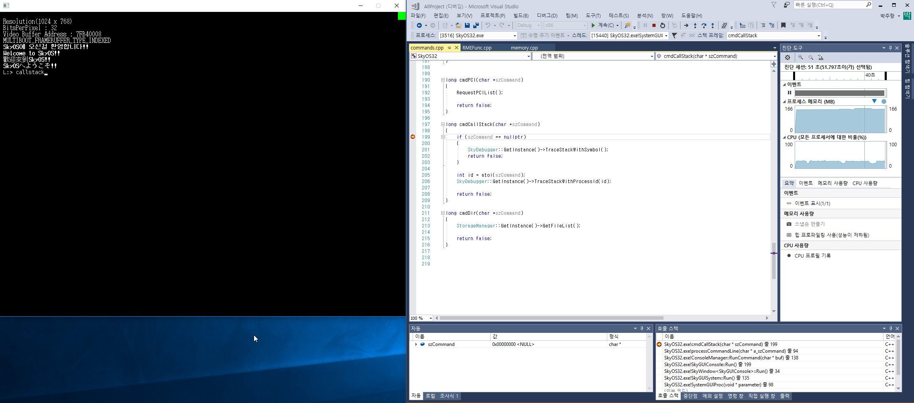

SkyOS++
----------------

SkyOS\++은 'C++로 나만의 운영체제 개발하기'에서 소개한 SkyOS32의  
바통을 이어받아 개발진행중인 프로젝트입니다.  
그래서 이 저장소에 오신분은 SkyOS32에 대해 이미 알고 있다고 가정합니다.  

프로젝트 목표
-------

개발을 WIN32에서 진행하기 위해 하드웨어 종속적인 부분과 순수 프로그래밍 영역 분리  
WIN32 / SKYOS++ 두 플랫폼에서 동시에 동작할 수 있는 커널 시스템 개발  

WIN32 디버깅
-------
